# Plan Import Complet - 70 Documents Photovoltaïques

## Vue d'Ensemble

| Metrique | Valeur |
|----------|--------|
| **Total PDFs** | 70 fichiers |
| **Deja traites** | 1 (ABB TRIO Manuel) |
| **A traiter** | 69 fichiers |
| **MCPs utilises** | pdf-tools, sqlite, content-core, faiss |
| **Destination** | Supabase (procedures, tips, settings) |

## Repartition par Marque

| Marque | PDFs | Priorite | Status |
|--------|------|----------|--------|
| ABB | 11 (10 restants) | 1 | 1 fait |
| Goodwe | 20 | 2 | A faire |
| Huawei | 16 | 3 | A faire |
| Delta | 14 | 4 | A faire |
| Webdynsun | 3 | 5 | A faire |
| WebdynsunPM | 2 | 6 | A faire |
| Sungrow | 2 | 7 | A faire |
| Bridage | 2 | 8 | A faire |

---

## Architecture du Pipeline

```mermaid
flowchart TD
    subgraph phase1 [Phase 1: Extraction PDF]
        A[PDF Source] --> B[pdf-tools.get_metadata]
        B --> C[pdf-tools.get_text_json pages 1-5]
        C --> D[pdf-tools.display_page_as_image page 1]
        D --> E[sqlite.create_record document_processing]
    end
    
    subgraph phase2 [Phase 2: Analyse IA]
        E --> F[content-core.extract_content]
        F --> G[sqlite.update_records status=analyzed]
    end
    
    subgraph phase3 [Phase 3: Structuration]
        G --> H[Generer procedures depuis analyse]
        H --> I[Generer tips depuis analyse]
        I --> J[sqlite.create_record local_procedures]
        J --> K[sqlite.create_record local_tips]
        K --> L[sqlite.update_records status=structured]
    end
    
    subgraph phase4 [Phase 4: Validation]
        L --> M[Calculer quality_score]
        M --> N[Verifier completude]
        N --> O[sqlite.update_records status=validated]
    end
    
    subgraph phase5 [Phase 5: Embeddings]
        O --> P[faiss.ingest_document procedures]
        P --> Q[faiss.ingest_document tips]
        Q --> R[faiss.query_rag_store test]
    end
    
    subgraph phase6 [Phase 6: Migration Supabase]
        R --> S[POST /api/procedures]
        S --> T[POST /api/tips]
        T --> U[sqlite.update_records status=production]
    end
```



---

## Phase 0: Preparation Infrastructure

### 0.1 Verifier Base SQLite Locale
```
MCP: sqlite.list_tables()
MCP: sqlite.get_table_schema("document_processing")
MCP: sqlite.get_table_schema("local_procedures")
MCP: sqlite.get_table_schema("local_tips")
```

### 0.2 Verifier Migration Supabase
La table `message_ratings` doit exister pour les nouvelles fonctionnalites:
- Historique chat persistant
- Mode double reponse
- Feedback like/dislike
- Auto-learning

### 0.3 Verifier APIs Production
- GET /api/procedures - Liste procedures
- POST /api/procedures - Creer procedure
- POST /api/tips - Creer tip
- POST /api/settings - Creer setting

---

## Phase 1: Import ABB (10 PDFs restants)

### Documents ABB a traiter:

1. `@ Installation et mise en service PVS100_120_rev20181123 (1).pdf`
2. `@ Installation et mise en service TRIO50-TM_rev20180320.pdf`
3. `Communication - projets APEX rev1.pdf`
4. `Config Passage AURORA à MOBDUS Onduleur ABB TRIO.pdf`
5. `Dossier mise en service ABB.pdf`
6. `MES & reglages PVS50-60-100-120.pdf`
7. `MES TRIO27.6.pdf`
8. `Onduleurs-Com.pdf`
9. `PVS-100_120 - Manuel revB.pdf`
10. `TRIO-20.0-27.6-TL-OUTD-Product manual EN-RevE(M000001EG).pdf`

### Workflow par document:

#### Etape 1.1: Extraction PDF
```
MCP: pdf-tools.get_metadata(file_name="...")
MCP: pdf-tools.get_text_json(file_name="...", page_number=1)
MCP: pdf-tools.get_text_json(file_name="...", page_number=2)
... (pages 1-5 minimum)
MCP: pdf-tools.display_page_as_image(name="...", page_number=1)
```

#### Etape 1.2: Stockage Extraction
```
MCP: sqlite.create_record(
  table="document_processing",
  data={
    "file_path": "/Users/glenn/Desktop/procedures/docs/ABB/...",
    "file_name": "...",
    "brand": "ABB",
    "file_type": "pdf",
    "status": "extracted",
    "extraction_data": "{...}"
  }
)
```

#### Etape 1.3: Analyse IA
```
MCP: content-core.extract_content(file_path="...")
MCP: sqlite.update_records(
  table="document_processing",
  data={"analysis_data": "{...}", "status": "analyzed"},
  conditions={"file_name": "..."}
)
```

#### Etape 1.4: Structuration
```python
# Generer procedures depuis l'analyse
procedures = [
  {
    "title": "Installation onduleur ABB PVS100",
    "description": "Procedure complete d'installation...",
    "category": "ABB",
    "tags": ["onduleur", "PVS100", "installation"],
    "steps": [
      {"title": "Verifications prealables", "description": "...", "order": 1},
      {"title": "Montage mecanique", "description": "...", "order": 2},
      ...
    ]
  }
]

# Generer tips
tips = [
  {
    "title": "Conseil securite ABB PVS",
    "content": "Toujours couper le DC avant intervention...",
    "category": "ABB",
    "tags": ["securite", "PVS", "maintenance"]
  }
]
```

```
MCP: sqlite.create_record(table="local_procedures", data={...})
MCP: sqlite.create_record(table="local_tips", data={...})
MCP: sqlite.update_records(
  table="document_processing",
  data={"structured_data": "{...}", "status": "structured"},
  conditions={"file_name": "..."}
)
```

#### Etape 1.5: Validation Qualite
```
MCP: sqlite.read_records(table="local_procedures", conditions={"document_id": X})
# Calculer quality_score (0-1)
# Criteres: completude, clarte, steps >= 2, description > 50 chars

MCP: sqlite.update_records(
  table="local_procedures",
  data={"quality_score": 0.85},
  conditions={"id": X}
)
```

#### Etape 1.6: Generation Embeddings
```
MCP: faiss.ingest_document(
  document="[TITRE] Installation onduleur ABB PVS100 [DESCRIPTION] Procedure complete... [STEPS] 1. Verifications...",
  source="procedure_ABB_1"
)

MCP: faiss.query_rag_store(
  query="Comment installer onduleur ABB?",
  top_k=3
)
# Valider que le resultat est pertinent
```

#### Etape 1.7: Migration Supabase (via API)
```
POST /api/procedures
{
  "title": "Installation onduleur ABB PVS100",
  "description": "...",
  "category": "ABB",
  "tags": ["onduleur", "PVS100"],
  "steps": [...]
}

POST /api/tips
{
  "title": "Conseil securite ABB PVS",
  "content": "...",
  "category": "ABB",
  "tags": [...]
}
```

---

## Phase 2: Import Goodwe (20 PDFs)

### Documents Goodwe:

1. `Goodwe/Procédure GoodWe.pdf`
2. `Goodwe/MT/GW_SMT 12-60kW_User Manual-FR.pdf`
3. `Goodwe/MT/GW_LVMT, MT_User Manual-FR (1).pdf`
4. `Goodwe/GT/GW_GT_User-Manual-FR.pdf`
5. `Goodwe/Module 3_Depannage.pdf`
6. `Goodwe/GW_WiFi Kit _2_.pdf`
7. `Goodwe/GW_WiFi Configuration Instruction-EN.pdf`
8. `Goodwe/GoodWe grid-tied HT-series Modbus Protocol-customer version_V1.4.pdf`
9. `Goodwe/HT/GW_HT 1100V_Datasheet_EMEA-FR.pdf`
10. `Goodwe/HT/GW_HT 1100V_Quick Installation-POLY.pdf`
11. `Goodwe/HT/GW_HT 73-136kW_User Manual-FR.pdf`
12. `Goodwe/GoodWe grid-tied MTG2SMTSDTG2MSDNSXS Series Modbus Protocol...pdf`
13. `Goodwe/SEC3000C/SEC3000C_User_manual_V1.0 FR.pdf`
14. `Goodwe/SEC3000C/Ezlogger3000C_MODBUS_Interface_Description.pdf`
15. `Goodwe/SEC3000C/GW_SEC3000C_Fiche technique_EMEA-FR.pdf`
16. `Goodwe/SolarGo_MES_FR.pdf`
17. `Goodwe/TD_201808_Crystal_Error 010 Islanding_V1.1.pdf`
18. `Goodwe/GW_SolarGo_User Manual-EN (1).pdf`
19. `Goodwe/Procedure MES Goodwe 27_10_23.pdf`
20. `Goodwe/Procédure solargo_facteur_puissance.pdf`

### Meme workflow que Phase 1

---

## Phase 3: Import Huawei (16 PDFs)

### Documents Huawei:

1. `Huawei/Prcédure MES Huawei.pdf`
2. `Huawei/Mise à jour firmware depuis l_APP FusionSolar.pdf`
3. `Huawei/Manuel d_utilisation, SUN2000-(20KTL, 29.9KTL, 30KTL, 36KTL, 40KTL)-M3-fr.pdf`
4. `Huawei/FusionSolar Commercial & Industrial Smart PV Solution Technical Training...pdf`
5. `Huawei/Procédure câblage de la COM pour HAUWEI et programmation onduleurs.pdf`
6. `Huawei/Inverter Alarm Reference.pdf`
7. `Huawei/2021FSV7033 Exportation des journaux de l_application FusionSolar.pdf`
8. `Huawei/Manuel d_utilisation, SUN2000-(100KTL, 110KTL, 115KTL)-M2.pdf`
9. `Huawei/2021FSV7011Exportation des données de performance de l'onduleur.pdf`
10. `Huawei/Manuel d_utilisation, SUN2000-(50KTL-ZHM3, 50KTL-M3).pdf`
11. `Huawei/MES SL3000.pdf`
12. `Huawei/FR-EXT-SER-2021SL020 - Connexion au Smartlogger3000 .pdf`
13. `Huawei/FusionSolar App Quick Guide.pdf`
14. `Huawei/2020M3002 La réinitialisation du mot de passe des onduleurs SUN2000...pdf`
15. `Huawei/Manuel d_utilisation, SmartLogger3000 (3).pdf`
16. `Huawei/2020SL3008 Lexportation des journaux (fichiers logs) via SmartLogger300.._.pdf`

---

## Phase 4: Import Delta (14 PDFs)

### Documents Delta:

1. `Delta/Procédure_Réglages_DELTA.pdf`
2. `Delta/ProcédureDSS.pdf`
3. `Delta/DSS/DSS User Instruction_S.pdf`
4. `Delta/DSS/DSS 5.9/DSS User Instruction_S.pdf`
5. `Delta/DSS/DSS 7.5.1 230222/DSS Enterprise_0222/DSS_Guide.pdf`
6. `Delta/DSS/DSS 7.5.1 230222/DSS Enterprise_0222/DSS-20220217.pdf`
7. `Delta/DSS/DSS 6.6.3/DSS User Instruction_S.pdf`
8. `Delta/DSS/DSS 6.6.3/Commissioning_M70A_M125HV_en/DSSV5.90/DSS0909/DSS User Instruction_S.pdf`
9. `Delta/DSS/DSS 6.6.3/Commissioning_M70A_M125HV_en/Commissioning_M70A_M125HV_en.pdf`
10. `Delta/DSS/DSS 6.6.3/Commissioning_M70A_M125HV_en/Delta_Service_Software_DSS_en_de.pdf`
11. `Delta/DSS/DSS 6.6.3/DSS_Guide.pdf`
12. `Delta/Procédure_Réglages_DELTA_m70_m50flex 2.pdf`
13. `Delta/Dossier mise en service Delta.pdf`
14. `Delta/ProcédureDELTA-DSS.pdf`

---

## Phase 5: Import Autres Marques (9 PDFs)

### Webdynsun (3):
1. `Webdynsun/ConfigWebdynV2.pdf`
2. `Webdynsun/WebdynSun_Modbus.pdf`
3. `Webdynsun/Dossier mise en service Delta.pdf`

### WebdynsunPM (2):
1. `WebdynsunPM/ProcédureMESWebdynPM.pdf`
2. `WebdynsunPM/mise en service WebdynPM Autoconso.pdf`

### Sungrow (2):
1. `Sungrow/EN_UM_SG110CX_User Manual.pdf`
2. `Sungrow/Procédure gamme CX SUNGROW 2.pdf`

### Bridage Raccordement (2):
1. `Bridage Raccordement/WebdynPM - Delta.pdf`
2. `Bridage Raccordement/WebdynPM - Huawei.pdf`

---

## Phase 6: Migration SQLite vers Supabase

### 6.1 Lire toutes les procedures validees
```
MCP: sqlite.read_records(table="local_procedures", conditions={"quality_score": ">= 0.7"})
```

### 6.2 Migrer vers Supabase via API
Pour chaque procedure:
```
POST /api/procedures
Authorization: Bearer <token>
Content-Type: application/json

{
  "title": "...",
  "description": "...",
  "category": "...",
  "tags": [...],
  "steps": [...]
}
```

### 6.3 Lire tous les tips valides
```
MCP: sqlite.read_records(table="local_tips", conditions={"quality_score": ">= 0.7"})
```

### 6.4 Migrer tips vers Supabase
```
POST /api/tips
{
  "title": "...",
  "content": "...",
  "category": "...",
  "tags": [...]
}
```

### 6.5 Mettre a jour statut local
```
MCP: sqlite.update_records(
  table="document_processing",
  data={"status": "production"},
  conditions={"status": "validated"}
)
```

---

## Phase 7: Deploiement Vercel

### 7.1 Git Commit
```bash
git add .
git commit -m "feat: import 70 PDF documentation photovoltaique

- 11 documents ABB
- 20 documents Goodwe
- 16 documents Huawei
- 14 documents Delta
- 9 documents autres marques (Sungrow, Webdyn, Bridage)

Total: ~XX procedures, ~XX tips importes"
```

### 7.2 Git Push
```bash
git push origin main
```

### 7.3 Vercel Deploy Automatique
- Vercel detecte le push
- Build automatique
- Deploiement production

---

## Phase 8: Validation Finale

### 8.1 Verifier Application
```
MCP: browser.navigate("https://procedures.vercel.app/dashboard/procedures")
MCP: browser.snapshot()
# Verifier que les procedures sont visibles
```

### 8.2 Tester Chat IA
```
MCP: browser.navigate("https://procedures.vercel.app/dashboard/chat")
MCP: browser.type("Comment installer un onduleur ABB TRIO?")
MCP: browser.click("Envoyer")
# Verifier que la reponse utilise les nouvelles donnees
```

### 8.3 Tester Nouvelles Fonctionnalites
- [ ] Mode double reponse
- [ ] Mode concis
- [ ] Historique persistant
- [ ] Feedback like/dislike

---

## Gestion des Erreurs

### Strategie Continue
Le pipeline continue meme si un document echoue:

```python
for pdf in all_pdfs:
    try:
        process_document(pdf)
    except Exception as e:
        log_error(pdf, str(e))
        continue  # Continuer avec le suivant
```

### Log des Erreurs
```
MCP: sqlite.create_record(
  table="document_processing",
  data={
    "file_path": "...",
    "status": "error",
    "error_message": "..."
  }
)
```

### Rapport Final
A la fin, generer rapport:
- Nombre de documents traites avec succes
- Nombre d'erreurs
- Liste des documents en erreur
- Actions correctives suggerees

---

## Metriques de Succes

| Metrique | Objectif |
|----------|----------|
| Documents traites | >= 65/70 (93%) |
| Procedures creees | >= 50 |
| Tips crees | >= 30 |
| Quality score moyen | >= 0.75 |
| Recherche semantique | Resultats pertinents |
| Chat IA | Utilise nouvelles donnees |

---

## Resume Execution

1. **Phase 0**: Verifier infrastructure (5 min)
2. **Phase 1**: ABB - 10 docs (30 min)
3. **Phase 2**: Goodwe - 20 docs (60 min)
4. **Phase 3**: Huawei - 16 docs (50 min)
5. **Phase 4**: Delta - 14 docs (45 min)
6. **Phase 5**: Autres - 9 docs (30 min)
7. **Phase 6**: Migration Supabase (15 min)
8. **Phase 7**: Deploy Vercel (5 min)
9. **Phase 8**: Validation (10 min)

**Temps total estime**: ~4 heures

---

## Commandes MCP Utilisees

| MCP | Fonction | Usage |
|-----|----------|-------|
| pdf-tools | get_metadata | Metadonnees PDF |
| pdf-tools | get_text_json | Extraction texte structure |
| pdf-tools | display_page_as_image | Visualisation pages |
| sqlite | list_tables | Verification schema |
| sqlite | get_table_schema | Structure tables |
| sqlite | create_record | Insertion donnees |
| sqlite | read_records | Lecture donnees |
| sqlite | update_records | Mise a jour statut |
| content-core | extract_content | Analyse IA contenu |
| faiss | ingest_document | Creation embeddings |
| faiss | query_rag_store | Recherche semantique |
| browser | navigate | Navigation web |
| browser | snapshot | Capture etat page |
| browser | click/type | Interactions |
